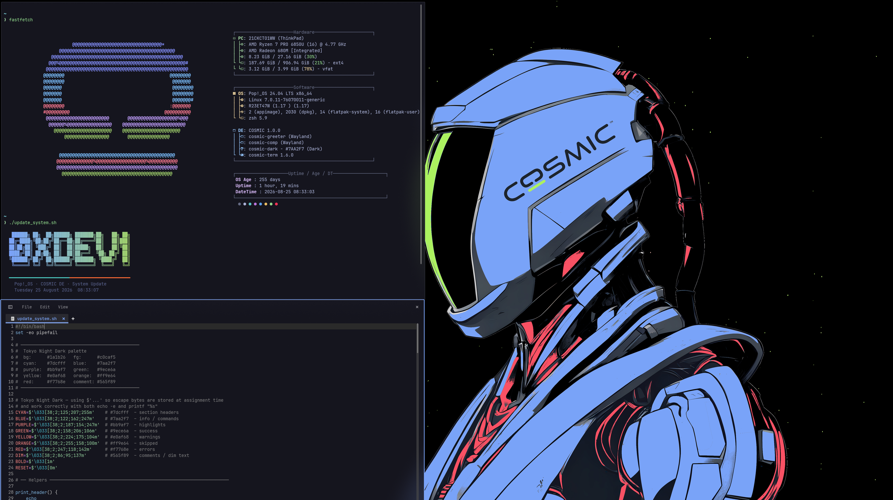
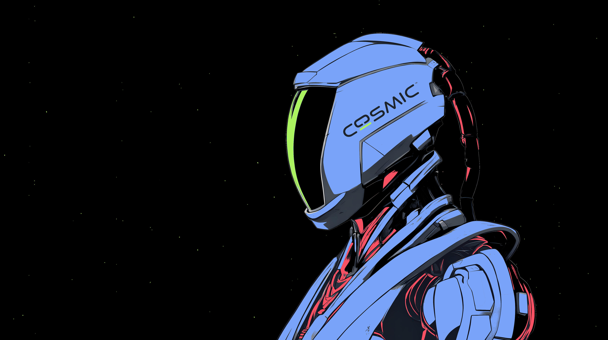

<div align="center">

# Pop!_OS · COSMIC · Tokyo Night

My personal desktop setup running Pop!_OS 24.04 LTS with the COSMIC DE and Tokyo Night Dark theming throughout: terminal, fastfetch, scripts, dotfiles, Firefox, and wallpapers all in one place.


</div>

---

## Screenshots




---

## Wallpapers

A dedicated Tokyo Night wallpaper collection with 60+ wallpapers lives over at
[tokyonight-wallpapers](https://github.com/atraxsrc/tokyonight-wallpapers).

---

## Repo Structure

```
.
├── dotfiles
│   └── .zshrc            # Zsh configuration
├── fastfetch
│   ├── config.jsonc      # Fastfetch configuration
│   ├── cosmicTN.txt
│   └── cosmic.txt
├── firefox               # Cosmic Night browser theme
│   ├── theme
│   │   ├── manifest.json # WebExtension theme, 40 colour keys
│   │   └── icons         # 32 / 48 / 64 / 96 / 128
│   ├── chrome
│   │   ├── userChrome.css   # Browser UI: rounded corners, menu borders
│   │   └── userContent.css  # New tab page accent colour
│   ├── install.sh        # Copies chrome/ into the default profile
│   └── README.md
├── screenshots           # Desktop screenshots
│   ├── cosmicfinal.png
│   └── miage.png
├── scripts
│   └── update_system.sh  # System update script (nala + flatpak + snap)
├── LICENSE
└── README.md
```

---

## Scripts

### `update_system.sh`

A full system update script with Tokyo Night colored output. Handles:

- nala package updates (with apt fallback)
- Flatpak updates
- Snap updates (if installed)
- Runtime timer and status indicators

```bash
# Make executable and run
chmod +x scripts/update_system.sh
sudo ./scripts/update_system.sh
```

---

## Firefox

**Cosmic Night** — a true-black Firefox theme whose palette is sampled from the
COSMIC wallpaper rather than taken from Tokyo Night, so it runs cooler and
darker than the rest of the rice. Blue chrome, a lime focus accent, red for
alerts.

```bash
# Stylesheets: rounded corners, menu borders, new tab accent
./firefox/install.sh
```

Then fully restart Firefox — `userChrome.css` is only parsed at startup.

The theme package itself is built from `firefox/theme/`:

```bash
cd firefox/theme && zip -r -X ../cosmic-night.zip . -x '.*'
```

Load it temporarily via `about:debugging`, or sign it at
[AMO](https://addons.mozilla.org/developers/) (choose *On your own* for an
unlisted, private build) for a permanent install. Firefox refuses unsigned
add-ons, so signing is unavoidable for the latter.

Full details, palette table, and CSS gotchas in
[`firefox/README.md`](firefox/README.md).

---

## Theme

Everything is themed around Tokyo Night Dark, a low-contrast, dark blue palette originally from the VSCode theme by the same name.

| Role | Color | Hex |
|------|-------|-----|
| Background |  Dark Navy | `#1a1b26` |
| Foreground |  Soft White | `#c0caf5` |
| Cyan |  Sky Blue | `#7dcfff` |
| Blue |  Periwinkle | `#7aa2f7` |
| Purple |  Lavender | `#bb9af7` |
| Green |  Sage | `#9ece6a` |
| Yellow |  Amber | `#e0af68` |
| Red |  Rose | `#f7768e` |

### Cosmic Night (Firefox)

Sampled from the wallpaper with k-means, then tuned until every text pair
clears WCAG AA. Darker and cooler than the palette above.

| Role | Color | Hex |
|------|-------|-----|
| Background |  True Black | `#000000` |
| Panels |  Shadow | `#171b23` |
| Blue |  Armor | `#79a3f7` |
| Lime |  Visor | `#a8ec61` |
| Red |  Under-suit | `#e04c5d` |
| Grey |  Mech Detail | `#3a3946` |
| Foreground |  Soft White | `#c3d0f5` |

---

## Setup

### Prerequisites

```bash
# Install nala (better apt frontend)
sudo apt install nala

# Install fastfetch
sudo add-apt-repository ppa:zhangsongcui3371/fastfetch
sudo nala update && sudo nala install fastfetch
```

### Apply dotfiles

```bash
# Clone the repo
git clone https://github.com/atraxsrc/Pop_OS-Cosmic-TokyoNight.git
cd Pop_OS-Cosmic-TokyoNight

# Copy zshrc
cp dotfiles/.zshrc ~/.zshrc

# Copy fastfetch config
mkdir -p ~/.config/fastfetch
cp fastfetch/config.jsonc ~/.config/fastfetch/

# Firefox stylesheets (optional)
./firefox/install.sh
```

---

## Stack

| Tool | What it does |
|------|-------------|
| [Pop!_OS 24.04](https://pop.system76.com/) | Base OS by System76 |
| [COSMIC DE](https://system76.com/cosmic) | Desktop environment (Rust + Iced) |
| [Tokyo Night](https://github.com/tokyo-night/tokyo-night-vscode-theme) | Color scheme |
| [fastfetch](https://github.com/fastfetch-cli/fastfetch) | System info fetcher |
| [nala](https://gitlab.com/volian/nala) | Better apt frontend |
| [zsh](https://www.zsh.org/) | Shell |
| [Firefox](https://www.mozilla.org/firefox/) | Browser, themed with Cosmic Night |

---

## License

MIT. Do whatever you want with it. Attribution appreciated but not required.

<div align="center">
  <sub>Built on Pop!_OS 24.04 · COSMIC 1.0.0 · Tokyo Night Dark</sub>
</div>
