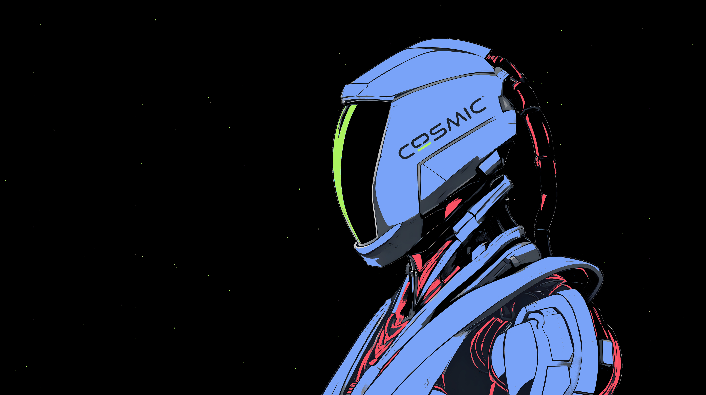
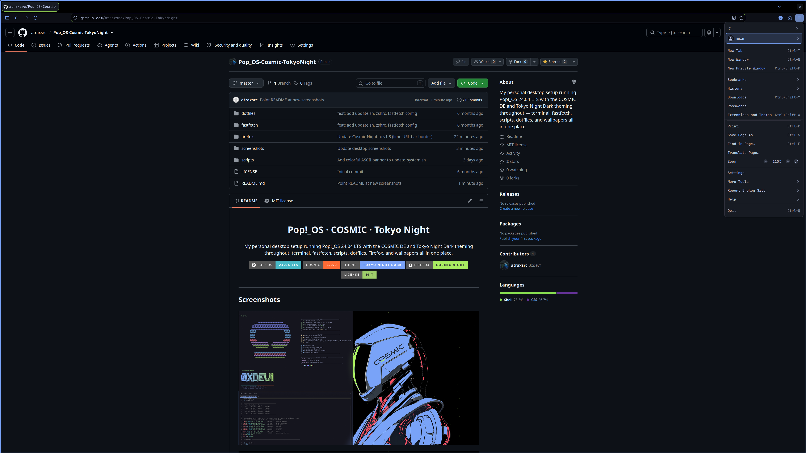
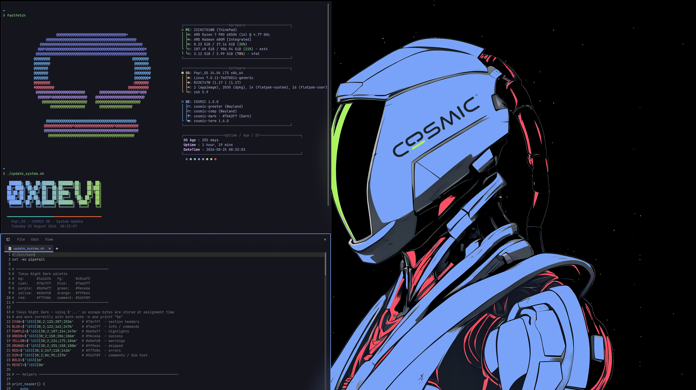

<div align="center">

# Pop!_OS · COSMIC · Tokyo Night

My personal desktop setup running Pop!_OS 24.04 LTS with the COSMIC DE and Tokyo Night Dark theming throughout: terminal, shell, fastfetch, btop, scripts, Firefox, and wallpapers all in one place.


</div>

---

## Screenshots





---

## Wallpapers

Wallpapers live in [cool-wallpapers](https://github.com/atraxsrc/cool-wallpapers),
a collection grouped by palette. The ones for this rice are in
[`tokyonight/`](https://github.com/atraxsrc/cool-wallpapers/tree/main/tokyonight)
and [`cosmic/`](https://github.com/atraxsrc/cool-wallpapers/tree/main/cosmic).

---

## Repo Structure

```
.
├── btop
│   └── TokyoNight.theme  # btop colour theme
├── cosmic
│   ├── TokyoNight.ron    # COSMIC Appearance import
│   ├── config/           # baseline settings: fonts, icons, terminal look
│   └── install.sh
├── cosmic-term
│   └── TokyoNight-term.ron  # COSMIC Terminal colour scheme
├── fastfetch
│   ├── config.jsonc      # Fastfetch configuration
│   ├── cosmicTN.txt      # COSMIC logo, Tokyo Night gradient
│   ├── cosmic.txt
│   └── install.sh
├── firefox               # Cosmic Night browser theme
│   ├── theme
│   │   ├── manifest.json # WebExtension theme, 40 colour keys
│   │   └── icons         # 32 / 48 / 64 / 96 / 128
│   ├── chrome
│   │   ├── userChrome.css   # Browser UI: rounded corners, menu borders
│   │   └── userContent.css  # New tab page accent colour
│   ├── install.sh        # Copies chrome/ into the default profile
│   └── README.md
├── screenshots           # Desktop screenshots
│   ├── firefox.png
│   ├── git1.png
│   └── git2.png
├── lsd
│   ├── config.yaml       # theme: custom
│   ├── colors.yaml       # permission / size / date / git columns
│   └── install.sh
├── scripts
│   └── update_system.sh  # System update script (nala + flatpak)
├── zsh
│   ├── tokyonight.zsh    # LS_COLORS, highlighting colours, aliases, starship
│   └── install.sh
├── LICENSE
└── README.md
```

---

## COSMIC Desktop

Settings → Desktop → Appearance → **Dark** → **Import** → `cosmic/TokyoNight.ron`

Sets the Tokyo Night background (`#1a1b26`), container (`#24283b`), accent
blue (`#7aa2f7`) and text tint. The rest of the palette is COSMIC's default
dark. Export from Appearance if you tweak it so you do not lose the changes.

Frosted glass is on in the `.ron` at `frosted: VeryLow` for windows, panel,
applets and system UI (maximized apps stay solid), and corners are squared
(`radius_*: 2.0`), the same as the DarkGold baseline. Adjust frosted glass on
Appearance → Style → Frosted glass after import; those sliders survive a theme switch.

### Baseline settings

`cosmic/config/` holds the settings that make up the look and rarely change
(panel, dock, applets and shortcuts are left out on purpose):

| Where | Setting |
|-------|---------|
| Fonts | Interface `Maple Normal UI`, monospace `Maple Mono Normal NFM` |
| Icons | Tokyonight-Dark |
| Windows | Minimize / maximize buttons hidden, theme applied to GNOME apps |
| Terminal | Maple Mono 15 (weights 500 / bold 800 / dim 300), 77% opacity, no header bar, Tokyo Night |

Install the [Maple fonts](https://github.com/subframe7536/maple-font) and the
icons (see Icons below) and import the terminal scheme (below) first, then:

```bash
./cosmic/install.sh
```

It backs up each file it replaces to `*.bak` and COSMIC applies it live.

---

## COSMIC Terminal

The desktop `.ron` does not colour ANSI text.

1. COSMIC Terminal → **View → Color schemes…** (not Settings → Appearance)
2. Dark tab → **Import** → `cosmic-term/TokyoNight-term.ron`
3. View → Settings → Appearance → Color scheme (dark) → **Tokyo Night**

If a profile is set as default, set the scheme on that profile too or the
dropdown will look like it did nothing.

---

## Scripts

### `update_system.sh`

A full system update script with Tokyo Night colored output. Handles:

- nala package updates (with apt fallback)
- Flatpak updates
- Snap updates: the function is included but off by default; uncomment
  `update_snap` in `main` to enable it
- Runtime timer and status indicators

```bash
# Make executable and run (it calls sudo itself where needed)
chmod +x scripts/update_system.sh
./scripts/update_system.sh
```

Don't run the whole script with `sudo`: `flatpak update` would then only
update system-wide installs and skip your per-user Flatpaks.

---

## Terminal extras

Need a [Nerd Font](https://www.nerdfonts.com/) in the terminal for the icons
(Maple Mono NFM in the baseline above).

### zsh

`zsh/tokyonight.zsh` is the rice part of the shell only: `LS_COLORS` (also
used by lsd for file names and by the completion menu), Tokyo Night colours
for zsh-autosuggestions and zsh-syntax-highlighting, lsd / bat / nvim aliases
and the starship prompt. Your own `~/.zshrc` stays private and sources it.

Needs zsh + [oh-my-zsh](https://ohmyz.sh/). `install.sh` clones the two
plugins if missing and appends one `source` line to `~/.zshrc` (backup in
`~/.zshrc.bak`):

```bash
./zsh/install.sh
exec zsh
```

In `~/.zshrc` set `ZSH_THEME=""` (starship draws the prompt) and
`plugins=(git sudo zsh-autosuggestions zsh-syntax-highlighting)`.

### lsd

File names are coloured by `LS_COLORS` from `zsh/tokyonight.zsh`;
`lsd/colors.yaml` colours the other columns with the nearest 256-colour
matches (149 green, 111 blue, 179 yellow, 210 red, 141 purple, 60 comment).
lsd 1.0.0 does not accept `#hex` there.

```bash
./lsd/install.sh
lsd -l
```

### fastfetch

COSMIC logo with a Tokyo Night gradient and Hardware / Software / Age boxes.
`install.sh` backs up any existing `~/.config/fastfetch/config.jsonc` to
`config.jsonc.bak`.

```bash
./fastfetch/install.sh
fastfetch
```

### btop

`btop/TokyoNight.theme`: navy background, blue titles, green → yellow → red
meters.

```bash
mkdir -p ~/.config/btop/themes
cp btop/TokyoNight.theme ~/.config/btop/themes/
# btop → Esc → Options → Color theme → TokyoNight
```

---

## Icons

Tokyonight-Dark from
[Fausto-Korpsvart/Tokyonight-GTK-Theme](https://github.com/Fausto-Korpsvart/Tokyonight-GTK-Theme/tree/master/icons)
(also in that folder: `-Dark-Cyan`, `-Moon`, `-Light`).

```bash
git clone --depth 1 https://github.com/Fausto-Korpsvart/Tokyonight-GTK-Theme.git
mkdir -p ~/.local/share/icons
cp -r Tokyonight-GTK-Theme/icons/Tokyonight-Dark ~/.local/share/icons/
# Settings → Desktop → Appearance → Icons → Tokyonight-Dark
```

---

## Firefox

**Cosmic Night**: a true-black Firefox theme whose palette is sampled from the
COSMIC wallpaper ([`cosmic-astronaut-firefox`](https://github.com/atraxsrc/cool-wallpapers/blob/main/cosmic/cosmic-astronaut-firefox-7168x4032.png))
rather than taken from Tokyo Night, so it runs cooler and
darker than the rest of the rice. Blue chrome, a lime focus accent, red for
alerts.

```bash
# Stylesheets: rounded corners, menu borders, new tab accent
./firefox/install.sh
```

Then fully restart Firefox: `userChrome.css` is only parsed at startup.

The theme package itself is built from `firefox/theme/`:

```bash
cd firefox/theme && zip -r -X ../cosmic-night.zip . -x '.*'
```

Load it temporarily via `about:debugging`, or sign it at
[AMO](https://addons.mozilla.org/developers/) (choose *On your own* for an
unlisted, private build) for a permanent install. Firefox refuses unsigned
add-ons, so signing is unavoidable for the latter.

Full details, palette table, and CSS gotchas in
[`firefox/README.md`](firefox/README.md).

---

## Theme

Everything is themed around Tokyo Night Dark, a low-contrast, dark blue palette originally from the VSCode theme by the same name.

| Role | Color | Hex |
|------|-------|-----|
| Background |  Dark Navy | `#1a1b26` |
| Foreground |  Soft White | `#c0caf5` |
| Cyan |  Sky Blue | `#7dcfff` |
| Blue |  Periwinkle | `#7aa2f7` |
| Purple |  Lavender | `#bb9af7` |
| Green |  Sage | `#9ece6a` |
| Yellow |  Amber | `#e0af68` |
| Red |  Rose | `#f7768e` |

### Cosmic Night (Firefox)

Sampled from the wallpaper with k-means, then tuned until every text pair
clears WCAG AA. Darker and cooler than the palette above.

| Role | Color | Hex |
|------|-------|-----|
| Background |  True Black | `#000000` |
| Panels |  Shadow | `#171b23` |
| Blue |  Armor | `#79a3f7` |
| Lime |  Visor | `#a8ec61` |
| Red |  Under-suit | `#e04c5d` |
| Grey |  Mech Detail | `#3a3946` |
| Foreground |  Soft White | `#c3d0f5` |

---

## Setup

### Prerequisites

```bash
# Install nala (better apt frontend)
sudo apt install nala

# Install fastfetch
sudo add-apt-repository ppa:zhangsongcui3371/fastfetch
sudo nala update && sudo nala install fastfetch
```

### Apply

```bash
# Clone the repo
git clone https://github.com/atraxsrc/cosmic-tokyonight-theme.git
cd cosmic-tokyonight-theme

# COSMIC theme
# Settings → Appearance → Dark → Import cosmic/TokyoNight.ron

# terminal
# View → Color schemes → Import cosmic-term/TokyoNight-term.ron

# shell + terminal tools (see Terminal extras above)
./zsh/install.sh
./lsd/install.sh
./fastfetch/install.sh
mkdir -p ~/.config/btop/themes && cp btop/TokyoNight.theme ~/.config/btop/themes/

# icons (see Icons above) + Maple fonts (https://github.com/subframe7536/maple-font), then
# fonts, icons, terminal look from cosmic/config/
./cosmic/install.sh

# Firefox stylesheets (optional)
./firefox/install.sh
```

---

## Stack

| Tool | What it does |
|------|-------------|
| [Pop!_OS 24.04](https://pop.system76.com/) | Base OS by System76 |
| [COSMIC DE](https://system76.com/cosmic) | Desktop environment (Rust + Iced) |
| [Tokyo Night](https://github.com/tokyo-night/tokyo-night-vscode-theme) | Color scheme |
| [fastfetch](https://github.com/fastfetch-cli/fastfetch) | System info fetcher |
| [nala](https://gitlab.com/volian/nala) | Better apt frontend |
| [zsh](https://www.zsh.org/) + [oh-my-zsh](https://ohmyz.sh/) | Shell |
| [lsd](https://github.com/lsd-rs/lsd) | `ls` with icons and colours |
| [btop](https://github.com/aristocratos/btop) | Resource monitor |
| [Tokyonight icons](https://github.com/Fausto-Korpsvart/Tokyonight-GTK-Theme/tree/master/icons) | Icon pack |
| [Firefox](https://www.mozilla.org/firefox/) | Browser, themed with Cosmic Night |

---

## License

MIT. Do whatever you want with it. Attribution appreciated but not required.

<div align="center">
  <sub>Built on Pop!_OS 24.04 · COSMIC 1.0.0 · Tokyo Night Dark</sub>
</div>
